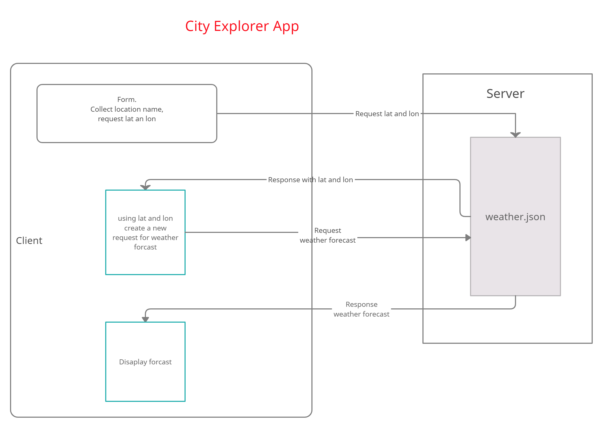
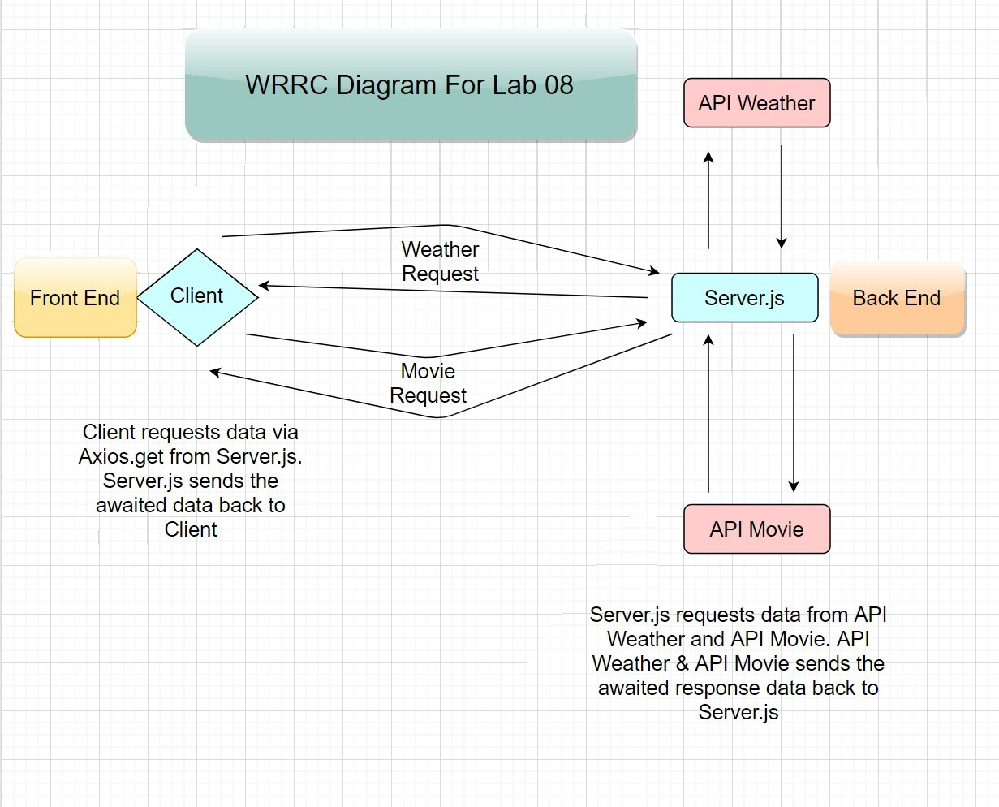

# Getting Started with Create React App

# Project Name

**Author**: Clarissa Pamonicutt
**Version**: 1.4.0 (increment the patch/fix version number if you make more commits past your first submission)

---

## Overview

As a user of City Explorer, I want to enter the name of a location so that I can see the exact latitude and longitude of that location.

As a user, I want to see a map of the city so that I can see the layout of the area I want to explore.

As a user, I want clear messages if something goes wrong so I know if I need to make any changes or try again in a different manner.

As a user of City Explorer, I want to see weather info for the city I searched, so that I know how to pack for an upcoming trip.

As a user, I want clear messages if something goes wrong so I know if I need to make any changes or try again in a different manner.

As a user of City Explorer, I want to see info about movies related to the city I searched, so that I can learn more about the destination.

Deploy your server. As a user, I want to access the City Explorer application on the web, so that anyone can explore from anywhere

Modularize the back-end codebase.

Refactor: Componentize the front-end codebase.

As a user, I want the application to work with recent results, so that I can see info without the app doing unnecessary API calls.

<!-- Provide a high level overview of what this application is and why you are building it, beyond the fact that it's an assignment for this class. (i.e. What's your problem domain?) -->

---

## Getting Started

***Important BEFORE merging to GitHub***
Building an .env file

- create a new file within the whole project
- file type is ".env" No additions, that's it.
- For a React App use this syntax:
  - `REACT_APP_`
- Follows with name/constant of your choosing
  - `REACT_APP_LOCATIONIQ_KEY`
- Assign with '=' then insert your key/token
  - `REACT_APP_LOCATIONIQ_KEY=bunchAgarbledMumboJumboThatIsYourToken`

Keep your key/token safe!
Do NOT call your entire key on app files, use the name ONLY!

***.env MUST BE ADDED TO YOUR .GITIGNORE. JUST .env NOTHING MORE***

Assigning an .env file

- process.env.NAME_OF_API_KEY

<!-- What are the steps that a user must take in order to build this app on their own machine and get it running? -->

---

## Architecture

Built using

- React.js
- React Bootstrap
- Axios
- LocationIQ
<!-- Provide a detailed description of the application design. What technologies (languages, libraries, etc) you're using, and any other relevant design information. -->

---

## Change Log

8/4/2021 - Location latitude and longitude displays. Map of the city displays. Error message displays in React Alert component when necessary.

8/7/2021 - An express server is set up for the application with a GET route for weather data. Try and catch methods are set up for weather errors.

<!-- Use this area to document the iterative changes made to your application as each feature is successfully implemented. Use time stamps. Here's an example:

01-01-2001 4:59pm - Application now has a fully-functional express server, with a GET route for the location resource. -->

---

## Credit and Collaborations

Ryan Gallaway

Ayrat Gimranov

Vinicio Sanchez

Joe Pennok

JP Jones

David Waiganjo

---

Name of feature: Location, map, and error.

Estimate of time needed to complete: 8 hours

Start time: 7/28

Finish time: 8/4

Actual time needed to complete: unknown

---

Name of feature: Lab 07 Custom Servers with Node and Express

Set up server repo, weather, and error code.

Estimate of time needed to complete: 2 days

Start time: 7/31 1/2 hour, 8/4 4 hours, 8/7 2 1/2 hours

Finish time: 8/7

Actual time needed to complete: 7 hours

---

Name of feature: Lab 08 APIs.

Add weather API key, add movies, publish

Estimate of time needed to complete: 5 hours

Start time: 8/7

Finish time:

Actual time needed to complete:

# need a description in your readme of what .env variables one needs to create if one was to clone down your repo

---

Name of feature: Lab 09 Refactoring into Modules

Clean up time!

Estimate of time needed to complete: 4 hours

Start time: _____

Finish time: _____

Actual time needed to complete: _____

---

Name of feature: Lab 10 Cache external API data in server storage, 

Estimate of time needed to complete: 5 hours

Start time: _____

Finish time: _____

Actual time needed to complete: _____

---